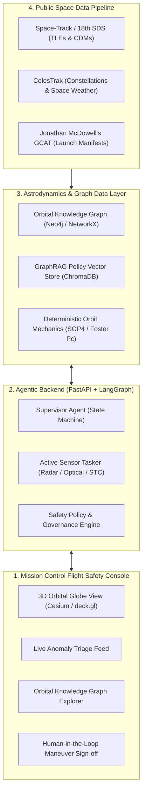

# Autonomous Space Anomaly Investigator (ASAI) — Product Implementation Plan

> [!IMPORTANT]
> **Product Vision:** ASAI is a full-fledged, autonomous Space Domain Awareness (SDA) and flight safety tool inspired by stateful agentic architectures. Instead of investigating financial fraud on bank accounts, ASAI investigates suspicious behavior of satellites and orbital debris, acts under observational uncertainty, tasks simulated sensors to collapse covariance, and recommends defensible next-best actions within human-in-the-loop safety boundaries.

---

## 1. System Architecture Overview

ASAI is designed as an end-to-end interactive flight safety platform comprising four decoupled tiers:

---

## 2. Core Functional Pillars

### Pillar 1: Multi-Modal Anomaly Ingestion
- **Kinematic Residuals:** Detects unexpected semi-major axis ($\Delta a$), inclination ($\Delta i$), or eccentricity ($\Delta e$) deviations indicating an unannounced thruster burn.
- **Conjunction Alerts (CDMs):** Ingests Conjunction Data Messages where nominal miss distance is small ($< 5\,\text{km}$) and baseline probability of collision ($P_c$) exceeds safety screening thresholds ($10^{-4}$).
- **Signal & Telemetry Discrepancies:** Flags sudden transponder loss-of-signal (LOS), carrier frequency drifting, or unregistered radio emissions.
- **Flight Director Inquiries:** Allows human operators to click any orbiting object or submit a prompt to investigate suspicious neighbors.

### Pillar 2: The Orbital Knowledge Graph
- **Graph Schema:**
  - `(:Satellite)`: NORAD ID, COSPAR ID, name, bus type, dry mass, operator, country, launch date, operational status.
  - `(:Debris)`: Parent object, RCS size category, fragmentation event ID.
  - `(:Operator)`: Nation state, commercial/military designation, contact protocol.
  - `(:LaunchEvent)`: Launch site, booster type, co-manifested payloads.
  - `(:GroundStation)`: Geolocation, antenna tracking mask, operator link.
  - `(:Conjunction)`: Time-of-Closest-Approach (TCA), miss distance, relative velocity.
- **Relational Edges:**
  - `(sat)-[:OPERATED_BY]->(operator)`
  - `(sat)-[:CO_LAUNCHED_WITH]->(sat)`
  - `(sat)-[:ORBITAL_NEIGHBOR {shell_km}]->(sat)`
  - `(sat)-[:IN_CONJUNCTION_WITH {tca, miss_km}]->(obj)`
  - `(sat)-[:TRANSMITS_ON]->(frequency)`
- **Graph Algorithms:** Subgraph pattern matching to identify co-orbital swarms, covert shadowing, and unannounced secondary payload deployments.

### Pillar 3: Active Sensing Under Uncertainty (The Controlled Loop)
- When state covariance is wide, the agent **refuses to guess or execute a premature collision avoidance maneuver (CAM)**.
- It formulates an optimal active sensing request:
  1. **Ground Optical Tasking:** Requests photometric light curves from robotic telescope networks (FFT analysis detects tumbling vs. stabilized pointing).
  2. **Radar Tracking Pass:** Requests a high-precision radar re-observation pass (LeoLabs style) to collapse the covariance matrix.
  3. **Space Traffic Coordination (STC) Query:** Pings the operator via automated channels to verify whether a planned burn occurred.
- Ingests the new observations, re-propagates the orbit, collapses the covariance ellipsoid, and re-computes $P_c$.

### Pillar 4: Policy Governance & Human Approval Gates
- **L0 (Autonomous):** Passive sensor queries, orbital catalog lookups, internal case progress logging.
- **L1 (Operator Advisory):** Situational safety bulletins transmitted to orbital neighborhood operators.
- **L2 (Mandatory Human Sign-Off):** Thruster burn execution ($\Delta v$), diplomatic ITU interference reports, or emergency flight notices.
- *The agent compiles the complete decision package: propellant budget required, post-burn secondary screening, and alternative maneuver geometries.*

### Pillar 5: Episodic Case Memory & Explainability
- Every resolved incident is stored with graph linkage and vector embeddings.
- Zero-shot retrieval recalls past anomalies (e.g., matching a new maneuver to an operator's historical 14-day station-keeping profile).
- Complete auditable explanation tree detailing observations used, covariance reduction history, and policy rules cited.

---

## 3. Implementation Roadmap

### Phase 1: Core Astrodynamics & Graph Data Layer
- [x] Integrate `sgp4` and `skyfield` for deterministic orbital propagation (TEME to J2000 frame conversion).
- [x] Implement 2D/3D collision probability calculation ($P_c$ via Foster algorithm).
- [x] Build in-memory NetworkX / Neo4j Orbital Knowledge Graph with multi-hop query methods.
- [x] Index NASA CARA ConOps, IADC Debris Guidelines, and ITU regulations into ChromaDB / Vector Store.

### Phase 2: Specialist Multi-Agent Orchestration (LangGraph)
- [x] `SupervisorAgent`: State machine managing investigation lifecycle and stopping criteria.
- [x] `ConjunctionAgent`: Computes miss distance, relative velocity, and B-plane covariance projection.
- [x] `KinematicsAgent`: Inverts orbital element residuals to estimate $\Delta v$ vector and burn magnitude.
- [x] `PhotometricAgent`: Analyzes optical light curves for tumbling frequency and attitude determination.
- [x] `PolicyEngine`: Enforces deterministic safety rules and L0/L1/L2 approval routing.
- [x] `ActiveTaskingNode`: Formulates sensor re-observation plans to collapse uncertainty.

### Phase 3: Interactive Mission Control Console (Frontend)
- [x] 3D Orbital Globe View using CesiumJS / deck.gl (rendering satellite orbits, debris clouds, and covariance ellipsoids).
- [x] Live Anomaly Triage Feed with severity tags (`CRITICAL`, `WARNING`, `ADVISORY`).
- [x] Interactive Knowledge Graph Inspector showing entity relationships and operator links.
- [x] Sensor Tasking Queue displaying active radar/optical re-observation status.
- [x] Human Sign-off Modal for authorizing Collision Avoidance Maneuver (CAM) thruster burns.

---

## 4. The 4 Live Demonstration Scenarios

To demonstrate the full power of the tool, the platform is pre-loaded with four compelling, interactive operational scenarios:

1. **Scenario 1: High-Covariance Conjunction $\rightarrow$ False Alarm Cleared (Fuel Saved)**
   - *Trigger:* CDM shows $120\,\text{m}$ miss distance, but cross-track covariance is $4.5\,\text{km}$.
   - *Action:* Agent recognizes uncertainty, tasks tracking radar, collapses covariance, proves true miss distance is $4.2\,\text{km}$, and cancels the CAM burn, saving irreplaceable propellant.
2. **Scenario 2: Non-Cooperative Inspector Satellite $\rightarrow$ Covert RPO Detection**
   - *Trigger:* Unannounced secondary satellite performs a plane change into the orbital slot of a defense communications satellite.
   - *Action:* Agent walks the knowledge graph, correlates parent launch records, identifies foreign state operator, detects coordinated low-thrust shadowing, and drafts an operator advisory and formal UN space registry report.
3. **Scenario 3: Sudden Drag Anomaly $\rightarrow$ Tumbling Spacecraft Triage**
   - *Trigger:* Earth observation satellite experiences sudden altitude decay and loss of telemetry.
   - *Action:* Agent tasks robotic ground optical sensors for photometric light curves. FFT analysis reveals a $0.4\,\text{Hz}$ oscillation, confirming attitude control (ADCS) failure and tumbling.
4. **Scenario 4: Imminent Debris Conjunction $\rightarrow$ Human-Approved CAM Burn**
   - *Trigger:* Weather satellite on collision course with defunct rocket body ($P_c = 5.2 \times 10^{-3}$, miss distance $< 50\,\text{m}$).
   - *Action:* Agent computes minimum-$\Delta v$ impulsive burn plan ($0.35\,\text{m/s}$ prograde), screens post-maneuver trajectory against secondary collisions, and routes burn package to the human Flight Dynamics Officer for one-click authorization.
